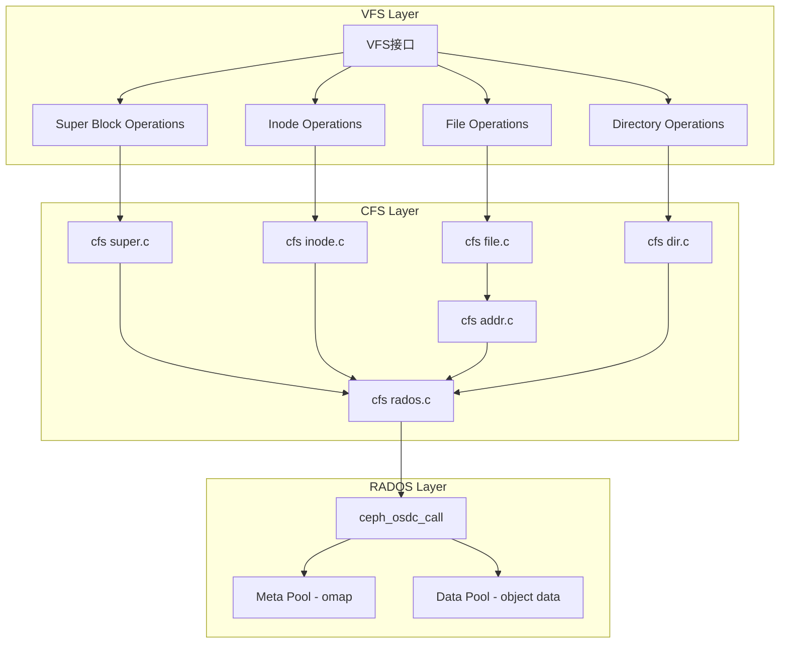
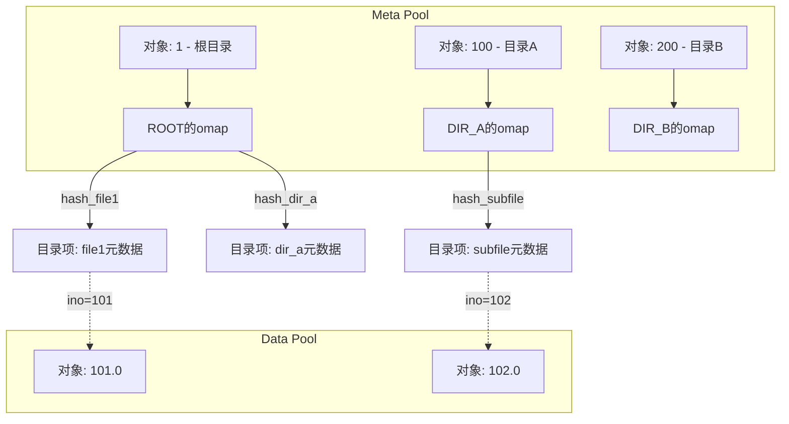
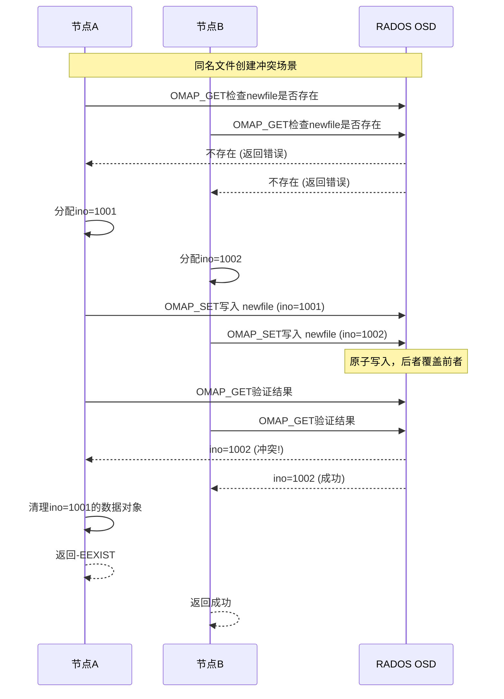
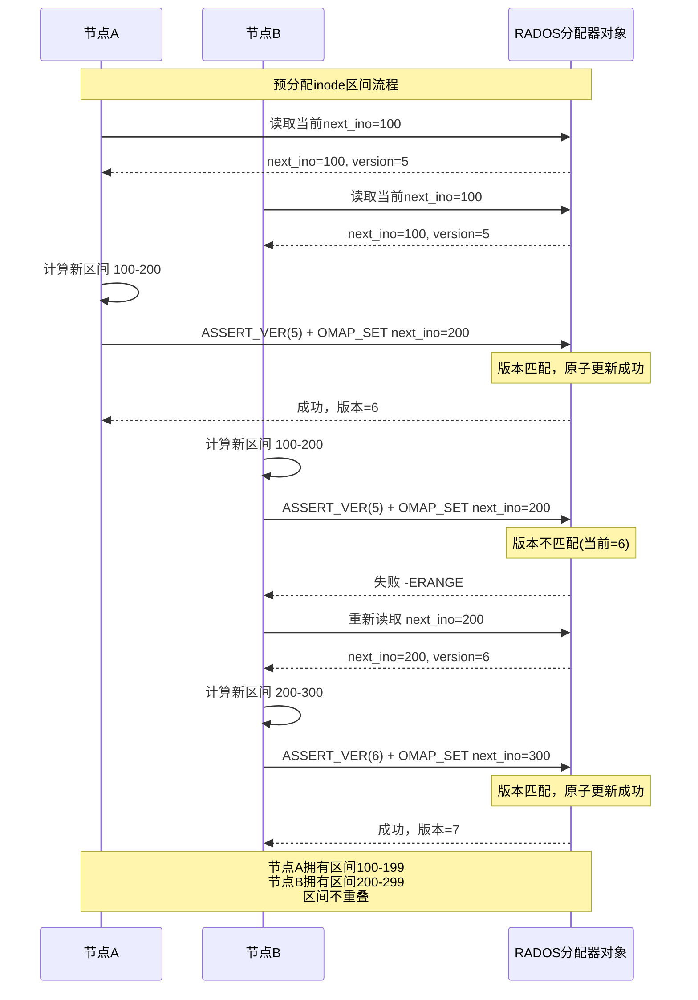
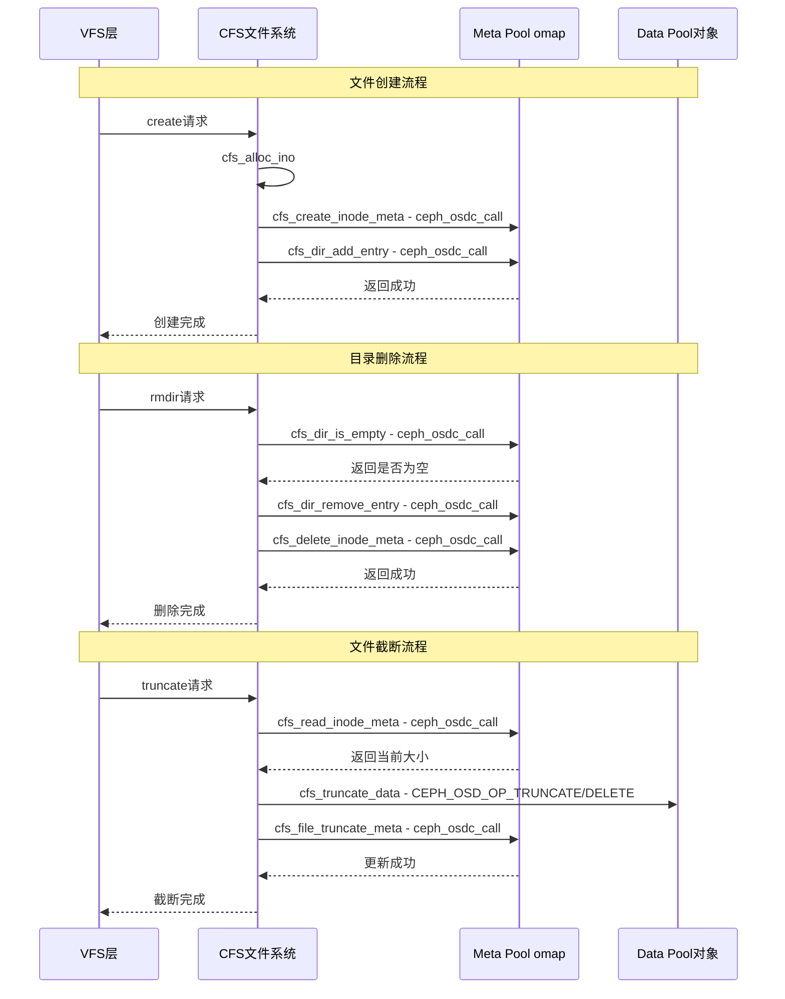
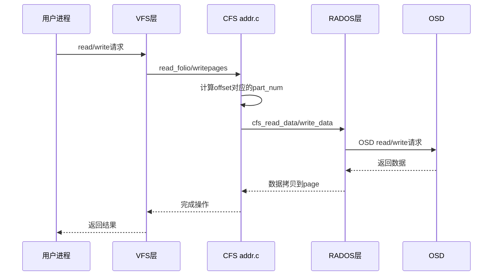
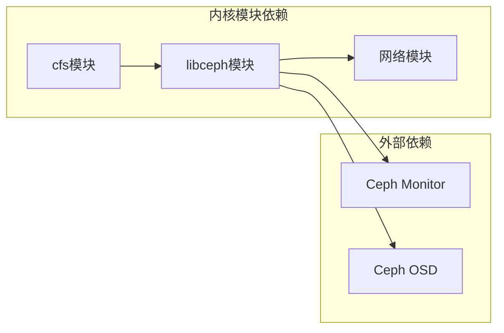

# CFS文件系统驱动设计与实现计划

## 1. 概述

CFS（CephFS Simple）是一个参考ramfs实现的简单文件系统驱动，向上对接Linux VFS，向下通过net/ceph模块中的`ceph_osdc_call`与Ceph RADOS通信。

### 1.1 设计目标
- 实现一个简单、可靠的POSIX兼容文件系统
- 元数据存储在RADOS meta pool的对象omap中
- 文件数据按4MB切片存储在RADOS data pool中
- 无需MDS（元数据服务器），直接与OSD通信

### 1.2 参考实现
- **ramfs**: 提供简单文件系统的VFS对接框架
- **ceph**: 提供RADOS通信接口和OSD客户端

## 2. 系统架构



## 3. 数据结构设计

### 3.1 核心数据结构

#### 3.1.1 cfs_inode_info - inode扩展信息

```c
struct cfs_inode_info {
    u64 i_ino;              // inode编号
    u64 i_parent_ino;       // 父目录inode号
    umode_t i_mode;         // 文件类型和权限
    u64 i_size;             // 文件大小
    u64 i_blocks;           // 4MB块数量
    struct timespec64 i_atime;  // 访问时间
    struct timespec64 i_mtime;  // 修改时间
    struct timespec64 i_ctime;  // 创建时间
    u32 i_nlink;            // 链接数
    u32 i_uid;              // 用户ID
    u32 i_gid;              // 组ID
    char *i_name;           // 文件名（目录项）
    struct rb_node i_node;  // 红黑树节点用于缓存
    spinlock_t i_lock;      // 保护inode
};
```

#### 3.1.2 cfs_fs_info - 文件系统实例信息

```c
struct cfs_fs_info {
    struct ceph_client *client;     // ceph客户端
    struct ceph_osd_client *osdc;   // OSD客户端
    s64 meta_pool;                  // 元数据pool ID
    s64 data_pool;                  // 数据pool ID
    struct rb_root inode_cache;     // inode缓存红黑树
    spinlock_t cache_lock;          // 缓存锁
    u64 next_ino;                   // 下一个inode号分配器
    struct mutex ino_mutex;         // inode分配锁
};
```

#### 3.1.3 cfs_dentry_info - 目录项信息

```c
struct cfs_dentry_info {
    u64 d_ino;              // 对应inode号
    char *d_name;           // 文件名
    struct list_head d_list; // 目录项链表
};
```

### 3.2 元数据存储方案

采用扁平化的目录树存储layout，将目录项信息存储在父目录inode对应的rados对象omap中。

#### 3.2.1 存储架构概述



#### 3.2.2 Meta Pool对象命名规则

- **对象名格式**: `<ino>`（直接使用inode号作为对象名）
- **只有目录inode**需要创建meta对象（用于存储目录项omap）
- **文件inode不需要单独的meta对象**，其元数据完全存储在父目录的omap目录项中
- 对象使用omap存储目录项信息（仅目录类型）

```c
// 构造meta对象名（仅用于目录）
static inline void cfs_meta_oid(struct ceph_object_id *oid, u64 dir_ino)
{
    ceph_oid_printf(oid, "%llu", dir_ino);
}

// 判断是否需要创建meta对象
static inline bool cfs_need_meta_object(umode_t mode)
{
    return S_ISDIR(mode);  // 只有目录需要meta对象
}
```

**设计优势**：
1. 简化存储结构，减少对象数量
2. 文件元数据与目录项合并，查找更高效
3. 文件创建/删除只需操作父目录的omap，无需额外对象管理

#### 3.2.3 目录项存储结构（omap）

目录项存储在**父目录inode对应的meta对象的omap**中：

| 字段 | 格式 | 说明 |
|------|------|------|
| **omap key** | `<hash_hex>_<name>` | hash值为目录项名称的rjenkins hash |
| **omap value** | 目录项元数据结构 | 包含完整元数据信息 |

```c
// omap key生成示例
// 使用ceph_str_hash_rjenkins计算hash值
static inline void cfs_make_dentry_key(char *key_buf, size_t buf_size,
                                        const char *name, unsigned name_len)
{
    unsigned int hash = ceph_str_hash_rjenkins(name, name_len);
    snprintf(key_buf, buf_size, "%08x_%s", hash, name);
}

// omap中存储的目录项元数据结构
struct cfs_dentry_metadata {
    u8 struct_v;            // 结构版本 = 1
    u8 struct_compat;       // 兼容版本 = 1
    u32 struct_len;         // 结构长度
    
    // 文件标识信息
    u64 ino;                // inode号（唯一标识）
    u32 name_len;           // 文件名长度
    char name[];            // 文件名（可变长，作为唯一标识）
    
    // inode属性信息
    u32 mode;               // 文件类型和权限 S_IFDIR/S_IFREG等
    u64 size;               // 文件大小（目录为0或条目数）
    u64 blocks;             // 数据块数（文件数据切片数）
    
    // 时间戳
    struct ceph_timespec atime;  // 访问时间
    struct ceph_timespec mtime;  // 修改时间
    struct ceph_timespec ctime;  // 创建/变更时间
    
    // 用户/组信息
    u32 nlink;              // 链接数
    u32 uid;                // 用户ID
    u32 gid;                // 组ID
    
    // 特殊文件信息
    u64 parent_ino;         // 父目录inode号
    u64 rdev;               // 设备号（仅特殊文件）
    u32 symlink_len;        // 符号链接目标长度（仅符号链接）
    // char symlink_target[]; // 符号链接目标（可选，紧随结构后）
};
```

#### 3.2.4 目录树存储示例

假设目录树结构如下：
```
/ (ino=1)
├── file1.txt (ino=101, regular file)
├── dir_a (ino=100, directory)
│   └── subfile.txt (ino=102, regular file)
└── file2.txt (ino=103, regular file)
```

**Meta Pool对象和omap内容**：

| 对象名 | omap key | omap value内容 |
|--------|----------|---------------|
| `1` (根目录) | `0x12345678_file1.txt` | dentry_meta: ino=101, mode=S_IFREG, name="file1.txt"... |
| | `0xabcdef00_dir_a` | dentry_meta: ino=100, mode=S_IFDIR, name="dir_a"... |
| | `0x5678abcd_file2.txt` | dentry_meta: ino=103, mode=S_IFREG, name="file2.txt"... |
| `100` (dir_a) | `0x99887766_subfile.txt` | dentry_meta: ino=102, mode=S_IFREG, name="subfile.txt"... |
| **注意**: 文件(101/102/103)不需要单独的meta对象 |

#### 3.2.5 目录操作流程

```c
// 目录项查找（lookup）流程
int cfs_lookup(struct cfs_fs_info *fsi, u64 dir_ino, const char *name,
               struct cfs_dentry_metadata *dmeta)
{
    char key[256];
    struct page *resp_page;
    size_t resp_len = PAGE_SIZE;
    int ret;
    
    // 1. 构造omap key
    cfs_make_dentry_key(key, sizeof(key), name, strlen(name));
    
    // 2. 从父目录的meta对象omap中读取（对象名直接使用inode号）
    cfs_meta_oid(&oid, dir_ino);
    oloc.pool = fsi->meta_pool;
    
    ret = cfs_meta_omap_get(fsi->osdc, &oid, &oloc, key,
                            page_address(resp_page), &resp_len);
    
    // 3. 解析目录项元数据
    if (ret >= 0) {
        decode_dentry_metadata(page_address(resp_page), dmeta);
    }
    
    return ret;
}

// 目录项添加（创建文件/目录）流程
int cfs_add_dentry(struct cfs_fs_info *fsi, u64 dir_ino, const char *name,
                   struct cfs_dentry_metadata *dmeta)
{
    char key[256];
    struct page *req_page;
    size_t req_len;
    int ret;
    
    // 1. 构造omap key
    cfs_make_dentry_key(key, sizeof(key), name, strlen(name));
    
    // 2. 序列化目录项元数据
    req_len = encode_dentry_metadata(dmeta, page_address(req_page));
    
    // 3. 写入父目录的meta对象omap（对象名直接使用inode号）
    cfs_meta_oid(&oid, dir_ino);
    oloc.pool = fsi->meta_pool;
    
    ret = cfs_meta_omap_set(fsi->osdc, &oid, &oloc, key,
                            page_address(req_page), req_len);
    
    // 4. 更新父目录的mtime和大小
    cfs_update_dir_stat(fsi, dir_ino);
    
    return ret;
}

// 目录项删除（unlink/rmdir）流程
int cfs_remove_dentry(struct cfs_fs_info *fsi, u64 dir_ino, const char *name)
{
    char key[256];
    int ret;
    
    // 1. 构造omap key
    cfs_make_dentry_key(key, sizeof(key), name, strlen(name));
    
    // 2. 从父目录的meta对象omap中删除（对象名直接使用inode号）
    cfs_meta_oid(&oid, dir_ino);
    oloc.pool = fsi->meta_pool;
    
    ret = cfs_meta_omap_rm(fsi->osdc, &oid, &oloc, key);
    
    // 3. 更新父目录的mtime和大小
    cfs_update_dir_stat(fsi, dir_ino);
    
    return ret;
}

// 目录遍历（readdir）流程
int cfs_readdir(struct cfs_fs_info *fsi, u64 dir_ino, loff_t offset,
                struct cfs_dentry_metadata **entries, u32 *count)
{
    // 使用omap遍历操作获取所有目录项
    // omap key格式: hash_name，可按key排序遍历
    ceph_oid_printf(&oid, "meta.%llu", dir_ino);
    oloc.pool = fsi->meta_pool;
    
    return cfs_meta_omap_list(fsi->osdc, &oid, &oloc, entries, count);
}
```

#### 3.2.6 文件名hash计算

使用 [`ceph_str_hash_rjenkins()`](net/ceph/ceph_hash.c:23) 计算文件名hash：

```c
#include <linux/ceph/ceph_hash.h>

// hash类型选择
#define CFS_HASH_TYPE  CEPH_STR_HASH_RJENKINS

// 计算目录项名称的hash值
static inline unsigned int cfs_name_hash(const char *name, unsigned len)
{
    return ceph_str_hash(CFS_HASH_TYPE, name, len);
}

// omap key格式: 8位十六进制hash + "_" + 文件名
// 示例: "a3b2c1d0_file.txt"
```

#### 3.2.7 乐观并发控制机制

解决多节点同时创建同名文件的并发冲突问题，采用以下乐观并发控制策略：

**问题场景**：
```
节点A: 在目录/dir下创建文件 "newfile.txt" (ino=1001)
节点B: 在目录/dir下同时创建文件 "newfile.txt" (ino=1002)
结果: 两个节点可能同时成功，导致数据不一致
```

**解决方案：omap条件写入**

利用RADOS omap操作的原子性，实现"检查-写入"原子操作：

```c
// 目录项创建的乐观并发控制
int cfs_create_dentry_safe(struct cfs_fs_info *fsi, u64 dir_ino,
                            const char *name, umode_t mode, u64 *new_ino)
{
    char key[256];
    struct page *req_page, *resp_page;
    struct cfs_dentry_metadata dmeta;
    u64 existing_ino;
    int ret, retry_count = 0;
    
    // 1. 构造omap key
    cfs_make_dentry_key(key, sizeof(key), name, strlen(name));
    
    // 2. 先尝试读取，检查是否存在（乐观假设不存在）
    ret = cfs_meta_omap_get(fsi->osdc, &oid, &oloc, key,
                            page_address(resp_page), &resp_len);
    
    if (ret >= 0) {
        // 目录项已存在，返回冲突错误
        decode_dentry_metadata(page_address(resp_page), &dmeta);
        *new_ino = dmeta.ino;
        return -EEXIST;  // 文件已存在
    }
    
    // 3. 目录项不存在，进行创建（乐观写入）
    // 分配新inode号
    *new_ino = cfs_alloc_ino(fsi);
    
    // 构造新的目录项元数据
    dmeta.ino = *new_ino;
    dmeta.mode = mode;
    dmeta.name = name;
    // ... 其他属性初始化
    
    // 4. 写入omap（原子操作）
    // RADOS omap set是原子的，如果同时有其他节点写入，后写入者覆盖前者
    ret = cfs_meta_omap_set(fsi->osdc, &oid, &oloc, key,
                            page_address(req_page), req_len);
    
    // 5. 验证写入结果（确认我们写入的inode号）
    if (ret >= 0) {
        // 再次读取验证
        ret = cfs_meta_omap_get(fsi->osdc, &oid, &oloc, key,
                                page_address(resp_page), &resp_len);
        if (ret >= 0) {
            struct cfs_dentry_metadata written_dmeta;
            decode_dentry_metadata(page_address(resp_page), &written_dmeta);
            
            if (written_dmeta.ino != *new_ino) {
                // 冲突发生：其他节点写入的值覆盖了我们的
                // 需要清理：删除我们分配的数据对象，回滚inode号
                cfs_cleanup_conflict(fsi, *new_ino);
                *new_ino = written_dmeta.ino;
                return -EEXIST;  // 返回冲突
            }
        }
    }
    
    return ret;
}

// 冲突清理函数
void cfs_cleanup_conflict(struct cfs_fs_info *fsi, u64 conflicted_ino)
{
    // 清理因冲突而创建的无效数据对象
    // 回滚inode号分配（标记为可用）
}
```

**增强方案：使用xattr版本控制**

对于更严格的并发控制，使用对象的xattr版本号：

```c
// 目录对象版本控制
// 在目录meta对象的xattr中存储版本号

#define CFS_DIR_VERSION_XATTR  "cfs.dir.version"

int cfs_create_dentry_with_version(struct cfs_fs_info *fsi, u64 dir_ino,
                                    const char *name, umode_t mode,
                                    u64 *new_ino)
{
    u64 current_version, expected_version;
    int ret;
    
    // 1. 获取当前目录版本
    ret = cfs_get_dir_version(fsi, dir_ino, &current_version);
    expected_version = current_version;
    
    // 2. 构造复合请求：检查版本 + 写入omap + 更新版本
    // 使用ASSERT_VER + OMAPSETVALS组合操作
    
    // 如果版本检查失败，整个操作失败
    // 如果版本检查成功，omap写入和版本更新同时完成
    
    // 3. 执行复合请求
    ret = cfs_atomic_create_dentry(fsi, dir_ino, name,
                                   expected_version, new_ino);
    
    if (ret == -ERANGE) {
        // 版本冲突，需要重试
        // 重新读取最新版本并重试
    }
    
    return ret;
}

// 复合原子操作实现
int cfs_atomic_create_dentry(struct cfs_fs_info *fsi, u64 dir_ino,
                              const char *name, u64 expected_version,
                              u64 *new_ino)
{
    struct ceph_osd_request *req;
    int ret;
    
    // 分配包含3个操作的请求
    req = ceph_osdc_alloc_request(fsi->osdc, NULL, 3, false, GFP_NOIO);
    
    // 操作1: ASSERT_VER - 验证目录版本
    osd_req_op_init(req, 0, CEPH_OSD_OP_ASSERT_VER, 0);
    req->r_ops[0].assert_ver.ver = expected_version;
    
    // 操作2: OMAPSETVALS - 写入新的目录项
    // ...
    
    // 操作3: SETXATTR - 更新目录版本号
    // ...
    
    // 执行请求
    ceph_osdc_start_request(fsi->osdc, req);
    ret = ceph_osdc_wait_request(fsi->osdc, req);
    
    ceph_osdc_put_request(req);
    return ret;
}
```

**并发控制流程图**：



**并发控制策略总结**：

| 操作 | 并发控制方法 | 失败处理 |
|------|-------------|----------|
| 文件创建 | omap写入验证 + inode清理 | 返回-EEXIST |
| 目录创建 | omap写入验证 + 数据对象清理 | 返回-EEXIST |
| 文件删除 | omap删除 + 重试 | 返回错误 |
| 目录删除 | 检查空目录 + omap删除 | 返回-ENOTEMPTY |
| 文件写入 | 数据对象版本检查 | 重试写入 |
| rename | 原子复合操作 | 重试 |
```

**hash前缀的作用**：
1. **均匀分布**: 使目录项在omap中均匀分布，避免热点
2. **有序遍历**: omap按key排序，hash前缀提供可预测的遍历顺序
3. **快速查找**: 可以利用hash值做初步匹配

### 3.3 数据存储方案

#### 3.3.1 Data Pool对象结构
- **对象名格式**: `<ino>.<part_num>`（简化命名，直接使用inode号）
- **切片大小**: 4MB (CFS_BLOCK_SIZE = 4 * 1024 * 1024)
- **part_num**: 从0开始递增，表示数据块序号

```c
#define CFS_BLOCK_SIZE      (4 * 1024 * 1024)  // 4MB
#define CFS_BLOCK_SHIFT     22                 // log2(4MB)

// 构造数据对象名
static inline void cfs_data_oid(struct ceph_object_id *oid, u64 ino, u32 part)
{
    ceph_oid_printf(oid, "%llu.%u", ino, part);
}

// 计算切片编号
static inline u32 cfs_part_num(u64 offset)
{
    return offset >> CFS_BLOCK_SHIFT;
}

// 计算片内偏移
static inline u64 cfs_part_offset(u64 offset)
{
    return offset & (CFS_BLOCK_SIZE - 1);
}

// 计算切片内可写入长度
static inline u64 cfs_part_remaining(u64 offset, u64 length)
{
    u64 part_offset = cfs_part_offset(offset);
    u64 remaining = CFS_BLOCK_SIZE - part_offset;
    return min(length, remaining);
}
```

#### 3.3.2 Inode号分配机制

inode号分配需要保证全局唯一性，支持多节点并发分配。采用RADOS事务性操作保证分配区间不冲突。

**核心设计思想**：
- 使用专门的RADOS对象存储全局inode分配计数器
- 每个节点通过原子操作预分配一个区间（如100个inode）
- 节点在本地区间内快速分配，无需频繁访问RADOS
- 使用 `CEPH_OSD_OP_ASSERT_VER + OMAP_SET` 组合实现原子区间预留



**数据结构定义**：

```c
// inode分配器对象名和key
#define CFS_INODE_ALLOCATOR_OID  "inode_allocator"
#define CFS_INODE_ALLOCATOR_KEY  "next_ino"

// inode号范围
#define CFS_ROOT_INO           1       // 根目录固定inode号
#define CFS_MIN_USER_INO       100     // 用户文件/目录起始ino
#define CFS_INO_BATCH_SIZE     100     // 每次预分配100个inode

// 本地inode分配器状态
struct cfs_ino_allocator {
    u64 local_next;        // 本地区间内下一个可用inode
    u64 local_end;         // 本地区间结束位置（exclusive）
    u64 global_version;    // 上次读取的全局版本号
    spinlock_t lock;       // 本地分配锁
    bool initialized;      // 是否已初始化
};

// 全局分配器omap存储结构
struct cfs_allocator_data {
    u8 struct_v;           // 结构版本 = 1
    u8 struct_compat;      // 兼容版本 = 1
    u32 struct_len;        // 结构长度
    u64 next_ino;          // 下一个可分配的inode号
    u64 version;           // 分配器版本号（每次更新递增）
};
```

**原子区间预留实现**：

```c
// 初始化inode分配器（挂载时调用）
int cfs_init_ino_allocator(struct cfs_fs_info *fsi)
{
    struct ceph_object_id oid;
    struct ceph_object_locator oloc;
    struct cfs_allocator_data alloc_data;
    size_t resp_len = sizeof(alloc_data);
    int ret;
    
    ceph_oid_set(&oid, CFS_INODE_ALLOCATOR_OID);
    oloc.pool = fsi->meta_pool;
    
    // 读取当前分配器状态
    ret = cfs_meta_omap_get(fsi->osdc, &oid, &oloc,
                            CFS_INODE_ALLOCATOR_KEY,
                            &alloc_data, &resp_len);
    
    if (ret < 0) {
        // 首次挂载，初始化分配器
        alloc_data.struct_v = 1;
        alloc_data.struct_compat = 1;
        alloc_data.struct_len = sizeof(alloc_data) - 6;
        alloc_data.next_ino = CFS_MIN_USER_INO;
        alloc_data.version = 1;
        
        ret = cfs_meta_omap_set(fsi->osdc, &oid, &oloc,
                                CFS_INODE_ALLOCATOR_KEY,
                                &alloc_data, sizeof(alloc_data));
        if (ret < 0)
            return ret;
    }
    
    // 预分配第一个区间
    ret = cfs_reserve_ino_batch(fsi, alloc_data.next_ino, alloc_data.version);
    if (ret < 0)
        return ret;
    
    spin_lock_init(&fsi->ino_alloc.lock);
    fsi->ino_alloc.initialized = true;
    
    return 0;
}

// 原子预分配inode区间（核心函数）
int cfs_reserve_ino_batch(struct cfs_fs_info *fsi, u64 expected_next, u64 expected_ver)
{
    struct ceph_object_id oid;
    struct ceph_object_locator oloc;
    struct ceph_osd_request *req;
    struct cfs_allocator_data alloc_data;
    struct page *req_page;
    int ret;
    
    ceph_oid_set(&oid, CFS_INODE_ALLOCATOR_OID);
    oloc.pool = fsi->meta_pool;
    
    // 分配包含2个操作的请求：ASSERT_VER + OMAP_SET
    req = ceph_osdc_alloc_request(fsi->osdc, NULL, 2, false, GFP_NOIO);
    if (!req)
        return -ENOMEM;
    
    ceph_oid_copy(&req->r_base_oid, &oid);
    ceph_oloc_copy(&req->r_base_oloc, &oloc);
    req->r_flags = CEPH_OSD_FLAG_WRITE;
    
    // 操作1: ASSERT_VER - 验证版本号（乐观锁）
    osd_req_op_init(req, 0, CEPH_OSD_OP_ASSERT_VER, 0);
    req->r_ops[0].assert_ver.ver = expected_ver;
    
    // 操作2: OMAP_SET - 更新next_ino
    alloc_data.struct_v = 1;
    alloc_data.struct_compat = 1;
    alloc_data.struct_len = sizeof(alloc_data) - 6;
    alloc_data.next_ino = expected_next + CFS_INO_BATCH_SIZE;
    alloc_data.version = expected_ver + 1;
    
    req_page = alloc_page(GFP_NOIO);
    if (!req_page) {
        ceph_osdc_put_request(req);
        return -ENOMEM;
    }
    
    encode_allocator_data(page_address(req_page), &alloc_data);
    
    // 使用cls方法设置omap
    ret = osd_req_op_cls_init(req, 1, "omap", "set");
    if (ret)
        goto out_free;
    
    osd_req_op_cls_request_data_pages(req, 1, &req_page,
                                       sizeof(alloc_data), 0, false, true);
    
    ret = ceph_osdc_alloc_messages(req, GFP_NOIO);
    if (ret)
        goto out_free;
    
    ceph_osdc_start_request(fsi->osdc, req);
    ret = ceph_osdc_wait_request(fsi->osdc, req);
    
    if (ret >= 0) {
        // 成功预留区间，更新本地状态
        spin_lock(&fsi->ino_alloc.lock);
        fsi->ino_alloc.local_next = expected_next;
        fsi->ino_alloc.local_end = expected_next + CFS_INO_BATCH_SIZE;
        fsi->ino_alloc.global_version = expected_ver + 1;
        spin_unlock(&fsi->ino_alloc.lock);
        
        pr_info("cfs: reserved inode range %llu-%llu\n",
                expected_next, expected_next + CFS_INO_BATCH_SIZE - 1);
    }
    
out_free:
    __free_page(req_page);
    ceph_osdc_put_request(req);
    return ret;
}

// 分配inode号（本地快速分配，失败时自动预留新区间）
u64 cfs_alloc_ino(struct cfs_fs_info *fsi)
{
    u64 ino;
    int ret;
    int retry_count = 0;
    
    spin_lock(&fsi->ino_alloc.lock);
    
    // 检查本地区间是否还有可用inode
    if (fsi->ino_alloc.local_next < fsi->ino_alloc.local_end) {
        ino = fsi->ino_alloc.local_next++;
        spin_unlock(&fsi->ino_alloc.lock);
        return ino;
    }
    
    // 本地区间耗尽，需要预留新区间
    spin_unlock(&fsi->ino_alloc.lock);
    
    // 读取当前全局状态
    struct cfs_allocator_data alloc_data;
    struct ceph_object_id oid;
    struct ceph_object_locator oloc;
    size_t resp_len = sizeof(alloc_data);
    
    ceph_oid_set(&oid, CFS_INODE_ALLOCATOR_OID);
    oloc.pool = fsi->meta_pool;
    
retry_reserve:
    ret = cfs_meta_omap_get(fsi->osdc, &oid, &oloc,
                            CFS_INODE_ALLOCATOR_KEY,
                            &alloc_data, &resp_len);
    
    if (ret < 0)
        return ret;
    
    // 尝试原子预留新区间
    ret = cfs_reserve_ino_batch(fsi, alloc_data.next_ino, alloc_data.version);
    
    if (ret == -ERANGE) {
        // 版本冲突，其他节点已预留，重试
        retry_count++;
        if (retry_count > 10) {
            pr_warn("cfs: failed to reserve inode batch after %d retries\n",
                    retry_count);
            return -EAGAIN;
        }
        goto retry_reserve;
    }
    
    if (ret < 0)
        return ret;
    
    // 预留成功，从新区间分配
    spin_lock(&fsi->ino_alloc.lock);
    ino = fsi->ino_alloc.local_next++;
    spin_unlock(&fsi->ino_alloc.lock);
    
    return ino;
}

// 回收inode号（可选，用于inode删除后回收）
void cfs_free_ino(struct cfs_fs_info *fsi, u64 ino)
{
    // 简化方案：不回收inode号，依赖64位空间足够大
    // 复杂方案：维护空闲inode列表，需要额外的RADOS对象
}
```

**多节点分配流程详解**：

```c
// 多节点并发分配示例
// 假设有3个节点同时创建文件

// 时序T0:
// 节点A: local_next=100, local_end=199, version=5
// 节点B: local_next=200, local_end=299, version=6  (已预留)
// 节点C: 未初始化

// 时序T1: 节点C挂载，需要预留区间
// RADOS: next_ino=300, version=7

// 时序T2: 节点A区间耗尽(100-199用完)
// 节点A读取: next_ino=300, version=7
// 节点A尝试预留: ASSERT_VER(7) + OMAP_SET next_ino=400
// 成功: 节点A获得区间300-399

// 结果：
// 节点A: 100-199, 300-399
// 节点B: 200-299
// 节点C: 300-399 (如果节点C在节点A之前预留)
```

**配置参数**：

```c
// 可配置的预分配大小
// 小批量: 减少inode浪费，增加RADOS访问频率
// 大批量: 减少RADOS访问，可能浪费inode
#define CFS_INO_BATCH_SIZE_DEFAULT  100
#define CFS_INO_BATCH_SIZE_MIN      10
#define CFS_INO_BATCH_SIZE_MAX      10000

// 挂载参数: ino_batch_size=N
enum cfs_param {
    Opt_ino_batch_size,  // 预分配批量大小
};
```

**注意事项**：
1. **inode浪费**: 节点预留后未用完的inode不会回收，依赖64位空间足够
2. **崩溃恢复**: 节点崩溃后其预留的区间丢失，但不会影响其他节点
3. **版本重试**: 多节点竞争时自动重试，最多10次
4. **全局一致性**: 通过RADOS原子操作保证全局一致性

// 从RADOS预分配inode号范围
int cfs_reserve_ino_range(struct cfs_fs_info *fsi, u64 count)
{
    struct ceph_object_id oid;
    struct ceph_object_locator oloc;
    u64 new_end;
    int ret;
    
    // 使用原子操作更新分配器
    // OMAP_CMP + OMAP_SET 组合确保原子性
    new_end = fsi->ino_alloc.allocated_end + count;
    
    // 写入新的分配结束位置
    ceph_oid_set(&oid, CFS_INODE_ALLOCATOR_OID);
    oloc.pool = fsi->meta_pool;
    
    ret = cfs_meta_omap_set(fsi->osdc, &oid, &oloc,
                            CFS_INODE_ALLOCATOR_KEY,
                            &new_end, sizeof(u64));
    
    if (ret >= 0) {
        fsi->ino_alloc.allocated_end = new_end;
    }
    
    return ret;
}

// 定期同步分配器状态到RADOS
void cfs_sync_ino_allocator(struct cfs_fs_info *fsi)
{
    // 可选：定期将next_ino同步到RADOS
    // 用于崩溃恢复后从正确位置继续分配
}
```

**方案二：分布式inode号生成（基于客户端ID）**

```c
// 每个客户端分配独立的inode号范围
// inode格式: (client_id << 32) | local_counter

#define CFS_INO_CLIENT_BITS    32
#define CFS_INO_LOCAL_BITS     32

static inline u64 cfs_make_ino(u32 client_id, u32 local_counter)
{
    return ((u64)client_id << CFS_INO_CLIENT_BITS) | local_counter;
}

static inline u32 cfs_ino_client(u64 ino)
{
    return ino >> CFS_INO_CLIENT_BITS;
}

static inline u32 cfs_ino_local(u64 ino)
{
    return ino & ((1ULL << CFS_INO_CLIENT_BITS) - 1);
}

// 获取客户端ID（连接时从monitor分配）
u32 cfs_get_client_id(struct ceph_client *client)
{
    return client->msgr.inst.name.num;
}
```

#### 3.3.3 数据切片读写详细设计

**文件数据布局**：

```
文件大小: 10MB
切片布局:
  对象 "101.0" (0-4MB)     -> part_num = 0
  对象 "101.1" (4-8MB)     -> part_num = 1
  对象 "101.2" (8-10MB)    -> part_num = 2 (部分填充，2MB数据)
```

**切片读写流程**：


**跨切片读取实现**：

```c
// 跨切片数据读取
int cfs_read_data_multi(struct cfs_fs_info *fsi, u64 ino,
                         u64 offset, u64 length,
                         struct page **pages, int num_pages)
{
    u64 bytes_read = 0;
    u64 current_offset = offset;
    int ret = 0;
    
    while (bytes_read < length) {
        u32 part_num = cfs_part_num(current_offset);
        u64 part_offset = cfs_part_offset(current_offset);
        u64 part_len = cfs_part_remaining(current_offset,
                                           length - bytes_read);
        
        // 计算当前页偏移
        int page_idx = bytes_read >> PAGE_SHIFT;
        int page_offset = bytes_read & (PAGE_SIZE - 1);
        
        // 读取单个切片
        ret = cfs_read_data_single(fsi, ino, part_num, part_offset,
                                   part_len, pages + page_idx,
                                   page_offset);
        
        if (ret < 0)
            break;
        
        bytes_read += part_len;
        current_offset += part_len;
    }
    
    return ret < 0 ? ret : bytes_read;
}

// 单切片读取
int cfs_read_data_single(struct cfs_fs_info *fsi, u64 ino, u32 part_num,
                          u64 offset, u64 length,
                          struct page **pages, int page_offset)
{
    struct ceph_object_id oid;
    struct ceph_object_locator oloc;
    struct ceph_osd_request *req;
    int ret;
    
    cfs_data_oid(&oid, ino, part_num);
    oloc.pool = fsi->data_pool;
    
    req = ceph_osdc_alloc_request(fsi->osdc, NULL, 1, false, GFP_NOIO);
    if (!req)
        return -ENOMEM;
    
    ceph_oid_copy(&req->r_base_oid, &oid);
    ceph_oloc_copy(&req->r_base_oloc, &oloc);
    req->r_flags = CEPH_OSD_FLAG_READ;
    
    osd_req_op_extent_init(req, 0, CEPH_OSD_OP_READ,
                           offset, length, 0, 0);
    osd_req_op_extent_osd_data_pages(req, 0, pages, length,
                                     page_offset, false, false);
    
    ret = ceph_osdc_alloc_messages(req, GFP_NOIO);
    if (ret)
        goto out_put_req;
    
    ceph_osdc_start_request(fsi->osdc, req);
    ret = ceph_osdc_wait_request(fsi->osdc, req);
    
out_put_req:
    ceph_osdc_put_request(req);
    return ret;
}
```

**跨切片写入实现**：

```c
// 跨切片数据写入
int cfs_write_data_multi(struct cfs_fs_info *fsi, u64 ino,
                          u64 offset, u64 length,
                          struct page **pages, int num_pages,
                          struct timespec64 *mtime)
{
    u64 bytes_written = 0;
    u64 current_offset = offset;
    u64 new_size = offset + length;
    int ret = 0;
    
    // 可能需要扩展文件，先确保数据对象存在
    u32 max_part = cfs_part_num(new_size - 1);
    
    while (bytes_written < length) {
        u32 part_num = cfs_part_num(current_offset);
        u64 part_offset = cfs_part_offset(current_offset);
        u64 part_len = cfs_part_remaining(current_offset,
                                           length - bytes_written);
        
        // 计算当前页偏移
        int page_idx = bytes_written >> PAGE_SHIFT;
        
        // 写入单个切片
        ret = cfs_write_data_single(fsi, ino, part_num, part_offset,
                                    part_len, pages + page_idx,
                                    mtime);
        
        if (ret < 0)
            break;
        
        bytes_written += part_len;
        current_offset += part_len;
    }
    
    // 更新文件大小（如果扩展了）
    if (ret >= 0 && new_size > current_file_size) {
        cfs_update_file_size(fsi, ino, new_size, mtime);
    }
    
    return ret < 0 ? ret : bytes_written;
}

// 单切片写入
int cfs_write_data_single(struct cfs_fs_info *fsi, u64 ino, u32 part_num,
                           u64 offset, u64 length,
                           struct page **pages,
                           struct timespec64 *mtime)
{
    struct ceph_object_id oid;
    struct ceph_object_locator oloc;
    struct ceph_osd_request *req;
    int ret;
    
    cfs_data_oid(&oid, ino, part_num);
    oloc.pool = fsi->data_pool;
    
    req = ceph_osdc_alloc_request(fsi->osdc, NULL, 1, false, GFP_NOIO);
    if (!req)
        return -ENOMEM;
    
    ceph_oid_copy(&req->r_base_oid, &oid);
    ceph_oloc_copy(&req->r_base_oloc, &oloc);
    req->r_flags = CEPH_OSD_FLAG_WRITE;
    req->r_mtime = *mtime;
    
    osd_req_op_extent_init(req, 0, CEPH_OSD_OP_WRITE,
                           offset, length, 0, 0);
    osd_req_op_extent_osd_data_pages(req, 0, pages, length,
                                     0, false, false);
    
    ret = ceph_osdc_alloc_messages(req, GFP_NOIO);
    if (ret)
        goto out_put_req;
    
    ceph_osdc_start_request(fsi->osdc, req);
    ret = ceph_osdc_wait_request(fsi->osdc, req);
    
out_put_req:
    ceph_osdc_put_request(req);
    return ret;
}
```

#### 3.3.4 文件截断操作

```c
// 文件截断
int cfs_truncate_file(struct cfs_fs_info *fsi, u64 ino,
                       u64 old_size, u64 new_size,
                       struct timespec64 *mtime)
{
    u32 old_max_part = cfs_part_num(old_size - 1) + 1;
    u32 new_max_part = new_size ? cfs_part_num(new_size - 1) + 1 : 0;
    int ret;
    
    if (new_size < old_size) {
        // 缩小文件
        
        // 1. 删除多余的数据对象
        for (u32 part = new_max_part; part < old_max_part; part++) {
            cfs_delete_data_object(fsi, ino, part);
        }
        
        // 2. 截断最后一个对象（如果不是整块边界）
        if (new_size > 0) {
            u32 last_part = new_max_part - 1;
            u64 part_end = new_size & (CFS_BLOCK_SIZE - 1);
            
            if (part_end > 0) {
                // 最后一个对象需要截断到新边界
                cfs_truncate_data_object(fsi, ino, last_part, part_end, mtime);
            }
        }
        
    } else if (new_size > old_size) {
        // 扩大文件（用零填充）
        // 可以选择不预分配对象，只在读取时返回零
        // 或者预先创建对象并写入零
        
        // 简化方案：只更新元数据大小，不预分配
    }
    
    // 3. 更新目录项中的文件大小
    ret = cfs_update_file_size_in_dentry(fsi, ino, new_size, mtime);
    
    return ret;
}
```

#### 3.3.5 文件删除时的数据清理

```c
// 删除文件的所有数据对象
int cfs_delete_all_data_objects(struct cfs_fs_info *fsi, u64 ino,
                                  u64 file_size)
{
    u32 max_part = file_size ? cfs_part_num(file_size - 1) + 1 : 0;
    int ret = 0;
    
    for (u32 part = 0; part < max_part; part++) {
        int err = cfs_delete_data_object(fsi, ino, part);
        if (err < 0 && err != -ENOENT) {
            ret = err;  // 记录错误但继续删除
        }
    }
    
    return ret;
}

// 删除单个数据对象
int cfs_delete_data_object(struct cfs_fs_info *fsi, u64 ino, u32 part_num)
{
    struct ceph_object_id oid;
    struct ceph_object_locator oloc;
    struct ceph_osd_request *req;
    int ret;
    
    cfs_data_oid(&oid, ino, part_num);
    oloc.pool = fsi->data_pool;
    
    req = ceph_osdc_alloc_request(fsi->osdc, NULL, 1, false, GFP_NOIO);
    if (!req)
        return -ENOMEM;
    
    ceph_oid_copy(&req->r_base_oid, &oid);
    ceph_oloc_copy(&req->r_base_oloc, &oloc);
    req->r_flags = CEPH_OSD_FLAG_WRITE;
    
    osd_req_op_init(req, 0, CEPH_OSD_OP_DELETE, 0);
    
    ret = ceph_osdc_alloc_messages(req, GFP_NOIO);
    if (ret)
        goto out_put_req;
    
    ceph_osdc_start_request(fsi->osdc, req);
    ret = ceph_osdc_wait_request(fsi->osdc, req);
    
out_put_req:
    ceph_osdc_put_request(req);
    return ret;
}
```

## 4. RADOS通信接口设计

### 4.1 cfs_rados.c接口层

基于`ceph_osdc_call`和原生OSD操作实现完整的文件系统元数据和数据接口。

#### 4.1.1 初始化和清理接口

```c
// 初始化rados连接
int cfs_rados_init(struct cfs_fs_info *fsi, const char *mon_addr);

// 清理rados连接
void cfs_rados_cleanup(struct cfs_fs_info *fsi);

// 连接到指定pool
int cfs_connect_pools(struct cfs_fs_info *fsi, const char *meta_pool_name,
                      const char *data_pool_name);
```

#### 4.1.2 Inode元数据操作接口

```c
// 创建新inode元数据（文件或目录创建时调用）
int cfs_create_inode_meta(struct cfs_fs_info *fsi, u64 parent_ino,
                          const char *name, umode_t mode, u64 *new_ino);

// 读取inode元数据（lookup、open、stat时调用）
int cfs_read_inode_meta(struct cfs_fs_info *fsi, u64 ino,
                        struct cfs_inode_metadata *meta);

// 写入/更新inode元数据（setattr、修改时间更新时调用）
int cfs_write_inode_meta(struct cfs_fs_info *fsi, u64 ino,
                         struct cfs_inode_metadata *meta);

// 删除inode元数据（文件/目录删除时调用）
int cfs_delete_inode_meta(struct cfs_fs_info *fsi, u64 ino);

// 获取inode属性（stat操作）
int cfs_get_inode_stat(struct cfs_fs_info *fsi, u64 ino,
                       struct kstat *stat);

// 设置inode属性（setattr操作：权限、时间、大小等）
int cfs_set_inode_attr(struct cfs_fs_info *fsi, u64 ino,
                       struct iattr *attr);

// 分配新的inode号
u64 cfs_alloc_ino(struct cfs_fs_info *fsi);

// 更新inode链接计数
int cfs_update_nlink(struct cfs_fs_info *fsi, u64 ino, int delta);
```

#### 4.1.3 目录操作接口

```c
// 目录创建（mkdir）
int cfs_dir_create(struct cfs_fs_info *fsi, u64 parent_ino,
                   const char *name, umode_t mode, u64 *new_dir_ino);

// 目录删除（rmdir）- 目录必须为空
int cfs_dir_delete(struct cfs_fs_info *fsi, u64 dir_ino);

// 目录项查找（lookup）
int cfs_dir_lookup(struct cfs_fs_info *fsi, u64 dir_ino, const char *name,
                   u64 *child_ino, struct cfs_inode_metadata *meta);

// 目录项添加（文件/子目录创建时调用）
int cfs_dir_add_entry(struct cfs_fs_info *fsi, u64 dir_ino, const char *name,
                      u64 child_ino, umode_t mode);

// 目录项删除（unlink/rmdir时调用）
int cfs_dir_remove_entry(struct cfs_fs_info *fsi, u64 dir_ino, const char *name);

// 目录遍历（readdir）
int cfs_dir_list(struct cfs_fs_info *fsi, u64 dir_ino, loff_t offset,
                 struct cfs_dentry_info **entries, u32 *count);

// 检查目录是否为空
int cfs_dir_is_empty(struct cfs_fs_info *fsi, u64 dir_ino);

// 目录项重命名（rename）
int cfs_dir_rename_entry(struct cfs_fs_info *fsi, u64 old_dir_ino,
                         const char *old_name, u64 new_dir_ino,
                         const char *new_name);
```

#### 4.1.4 文件操作接口（元数据部分）

```c
// 文件创建（create）
int cfs_file_create(struct cfs_fs_info *fsi, u64 parent_ino,
                    const char *name, umode_t mode, u64 *new_file_ino);

// 文件删除（unlink）
int cfs_file_delete(struct cfs_fs_info *fsi, u64 parent_ino,
                    const char *name, u64 file_ino);

// 文件截断（truncate）- 元数据部分
int cfs_file_truncate_meta(struct cfs_fs_info *fsi, u64 ino,
                           u64 new_size);

// 符号链接创建（symlink）
int cfs_symlink_create(struct cfs_fs_info *fsi, u64 parent_ino,
                       const char *name, const char *link_target,
                       u64 *new_link_ino);

// 符号链接目标读取
int cfs_symlink_read_target(struct cfs_fs_info *fsi, u64 link_ino,
                             char *target, size_t *len);

// 硬链接创建（link）
int cfs_hardlink_create(struct cfs_fs_info *fsi, u64 parent_ino,
                        const char *name, u64 existing_ino);
```

#### 4.1.5 特殊文件操作接口

```c
// 特殊文件创建（mknod - 设备文件、管道等）
int cfs_special_file_create(struct cfs_fs_info *fsi, u64 parent_ino,
                            const char *name, umode_t mode, dev_t rdev,
                            u64 *new_ino);
```

#### 4.1.6 数据操作接口（使用原生OSD操作）

```c
// 数据读取
int cfs_read_data(struct cfs_fs_info *fsi, u64 ino, u64 offset,
                  u64 length, struct page **pages);

// 数据写入
int cfs_write_data(struct cfs_fs_info *fsi, u64 ino, u64 offset,
                   u64 length, struct page **pages);

// 数据截断（truncate）- 数据部分
int cfs_truncate_data(struct cfs_fs_info *fsi, u64 ino, u64 old_size,
                      u64 new_size);

// 删除所有数据对象
int cfs_delete_all_data_objects(struct cfs_fs_info *fsi, u64 ino,
                                 u64 max_blocks);

// 创建数据对象（预分配）
int cfs_create_data_object(struct cfs_fs_info *fsi, u64 ino, u32 part_num);
```

#### 4.1.7 操作流程图



### 4.2 RADOS操作类型选择

采用混合策略以获得最佳性能：
- **元数据操作**: 使用 `ceph_osdc_call` 调用OSD class方法操作omap
- **数据操作**: 使用原生OSD读写操作（CEPH_OSD_OP_READ/WRITE）

#### 4.2.1 元数据操作（ceph_osdc_call + omap）

参考 [`cls_lock_client.c`](net/ceph/cls_lock_client.c) 的实现方式，使用 `ceph_osdc_call` 调用class方法操作omap：

```c
// 元数据存储在meta pool对象的omap中
// 使用ceph_osdc_call调用class方法来读写omap

// OMAP读取操作封装
static int cfs_meta_omap_get(struct ceph_osd_client *osdc,
                              struct ceph_object_id *oid,
                              struct ceph_object_locator *oloc,
                              const char *key, void *value, size_t *val_len)
{
    struct page *req_page, *resp_page;
    void *p;
    size_t resp_len = PAGE_SIZE;
    int ret;
    
    req_page = alloc_page(GFP_NOIO);
    if (!req_page)
        return -ENOMEM;
    
    resp_page = alloc_page(GFP_NOIO);
    if (!resp_page) {
        __free_page(req_page);
        return -ENOMEM;
    }
    
    // 编码请求参数（key名称）
    p = page_address(req_page);
    ceph_encode_string(&p, key, strlen(key));
    
    ret = ceph_osdc_call(osdc, oid, oloc,
                         "omap", "get",  // 调用omap class的get方法
                         CEPH_OSD_FLAG_READ,
                         req_page, strlen(key) + sizeof(__le32),
                         &resp_page, &resp_len);
    
    if (ret >= 0) {
        memcpy(value, page_address(resp_page), resp_len);
        *val_len = resp_len;
    }
    
    __free_page(req_page);
    __free_page(resp_page);
    return ret;
}

// OMAP写入操作封装
static int cfs_meta_omap_set(struct ceph_osd_client *osdc,
                              struct ceph_object_id *oid,
                              struct ceph_object_locator *oloc,
                              const char *key, void *value, size_t val_len)
{
    struct page *req_page;
    void *p;
    size_t req_len;
    int ret;
    
    req_len = strlen(key) + sizeof(__le32) + val_len + sizeof(__le32);
    req_page = alloc_page(GFP_NOIO);
    if (!req_page)
        return -ENOMEM;
    
    // 编码请求参数（key + value）
    p = page_address(req_page);
    ceph_encode_string(&p, key, strlen(key));
    ceph_encode_string(&p, value, val_len);
    
    ret = ceph_osdc_call(osdc, oid, oloc,
                         "omap", "set",
                         CEPH_OSD_FLAG_WRITE,
                         req_page, req_len,
                         NULL, NULL);
    
    __free_page(req_page);
    return ret;
}

// OMAP删除操作封装
static int cfs_meta_omap_rm(struct ceph_osd_client *osdc,
                              struct ceph_object_id *oid,
                              struct ceph_object_locator *oloc,
                              const char *key)
{
    struct page *req_page;
    void *p;
    int ret;
    
    req_page = alloc_page(GFP_NOIO);
    if (!req_page)
        return -ENOMEM;
    
    // 编码请求参数（要删除的key）
    p = page_address(req_page);
    ceph_encode_string(&p, key, strlen(key));
    
    ret = ceph_osdc_call(osdc, oid, oloc,
                         "omap", "rm",
                         CEPH_OSD_FLAG_WRITE,
                         req_page, strlen(key) + sizeof(__le32),
                         NULL, NULL);
    
    __free_page(req_page);
    return ret;
}

// OMAP列表操作封装（用于目录遍历）
static int cfs_meta_omap_list(struct ceph_osd_client *osdc,
                               struct ceph_object_id *oid,
                               struct ceph_object_locator *oloc,
                               struct cfs_omap_entry **entries, u32 *count)
{
    // 获取所有omap键值对，用于目录遍历
    // 需要根据返回数据解析entries数组
}
```

#### 4.2.2 数据操作（原生OSD READ/WRITE）

文件数据使用原生OSD操作，性能更高。参考 [`osd_client.c`](net/ceph/osd_client.c) 中 [`osd_req_op_extent_init()`](net/ceph/osd_client.c:758) 的使用方式：

```c
// 数据读取 - 使用CEPH_OSD_OP_READ
int cfs_data_read(struct ceph_osd_client *osdc, s64 data_pool,
                   u64 ino, u64 offset, u64 length,
                   struct page **pages)
{
    struct ceph_object_id oid;
    struct ceph_object_locator oloc;
    struct ceph_osd_request *req;
    u32 part_num, part_offset;
    int ret;
    
    // 计算切片编号和片内偏移
    part_num = offset >> CFS_BLOCK_SHIFT;      // 4MB切片编号
    part_offset = offset & (CFS_BLOCK_SIZE - 1); // 片内偏移
    
    // 构造对象ID和定位器
    ceph_oid_printf(&oid, "data_%llu.%u", ino, part_num);
    oloc.pool = data_pool;
    
    // 分配OSD请求
    req = ceph_osdc_alloc_request(osdc, NULL, 1, false, GFP_NOIO);
    if (!req)
        return -ENOMEM;
    
    ceph_oid_copy(&req->r_base_oid, &oid);
    ceph_oloc_copy(&req->r_base_oloc, &oloc);
    req->r_flags = CEPH_OSD_FLAG_READ;
    
    // 初始化READ操作
    osd_req_op_extent_init(req, 0, CEPH_OSD_OP_READ,
                           part_offset, length, 0, 0);
    osd_req_op_extent_osd_data_pages(req, 0, pages, length,
                                     0, false, false);
    
    ret = ceph_osdc_alloc_messages(req, GFP_NOIO);
    if (ret)
        goto out_put_req;
    
    ceph_osdc_start_request(osdc, req);
    ret = ceph_osdc_wait_request(osdc, req);
    
out_put_req:
    ceph_osdc_put_request(req);
    return ret;
}

// 数据写入 - 使用CEPH_OSD_OP_WRITE
int cfs_data_write(struct ceph_osd_client *osdc, s64 data_pool,
                    u64 ino, u64 offset, u64 length,
                    struct page **pages, struct timespec64 *mtime)
{
    struct ceph_object_id oid;
    struct ceph_object_locator oloc;
    struct ceph_osd_request *req;
    u32 part_num, part_offset;
    int ret;
    
    part_num = offset >> CFS_BLOCK_SHIFT;
    part_offset = offset & (CFS_BLOCK_SIZE - 1);
    
    ceph_oid_printf(&oid, "data_%llu.%u", ino, part_num);
    oloc.pool = data_pool;
    
    req = ceph_osdc_alloc_request(osdc, NULL, 1, false, GFP_NOIO);
    if (!req)
        return -ENOMEM;
    
    ceph_oid_copy(&req->r_base_oid, &oid);
    ceph_oloc_copy(&req->r_base_oloc, &oloc);
    req->r_flags = CEPH_OSD_FLAG_WRITE;
    req->r_mtime = *mtime;
    
    // 初始化WRITE操作
    osd_req_op_extent_init(req, 0, CEPH_OSD_OP_WRITE,
                           part_offset, length, 0, 0);
    osd_req_op_extent_osd_data_pages(req, 0, pages, length,
                                     0, false, false);
    
    ret = ceph_osdc_alloc_messages(req, GFP_NOIO);
    if (ret)
        goto out_put_req;
    
    ceph_osdc_start_request(osdc, req);
    ret = ceph_osdc_wait_request(osdc, req);
    
out_put_req:
    ceph_osdc_put_request(req);
    return ret;
}

// 数据删除 - 使用CEPH_OSD_OP_DELETE
int cfs_data_delete(struct ceph_osd_client *osdc, s64 data_pool,
                     u64 ino, u32 part_num)
{
    struct ceph_object_id oid;
    struct ceph_object_locator oloc;
    struct ceph_osd_request *req;
    int ret;
    
    ceph_oid_printf(&oid, "data_%llu.%u", ino, part_num);
    oloc.pool = data_pool;
    
    req = ceph_osdc_alloc_request(osdc, NULL, 1, false, GFP_NOIO);
    if (!req)
        return -ENOMEM;
    
    ceph_oid_copy(&req->r_base_oid, &oid);
    ceph_oloc_copy(&req->r_base_oloc, &oloc);
    req->r_flags = CEPH_OSD_FLAG_WRITE;
    
    // 初始化DELETE操作
    osd_req_op_init(req, 0, CEPH_OSD_OP_DELETE, 0);
    
    ret = ceph_osdc_alloc_messages(req, GFP_NOIO);
    if (ret)
        goto out_put_req;
    
    ceph_osdc_start_request(osdc, req);
    ret = ceph_osdc_wait_request(osdc, req);
    
out_put_req:
    ceph_osdc_put_request(req);
    return ret;
}

// 数据截断 - 使用CEPH_OSD_OP_TRUNCATE
int cfs_data_truncate(struct ceph_osd_client *osdc, s64 data_pool,
                       u64 ino, u32 part_num, u64 new_length,
                       struct timespec64 *mtime)
{
    struct ceph_object_id oid;
    struct ceph_object_locator oloc;
    struct ceph_osd_request *req;
    int ret;
    
    ceph_oid_printf(&oid, "data_%llu.%u", ino, part_num);
    oloc.pool = data_pool;
    
    req = ceph_osdc_alloc_request(osdc, NULL, 1, false, GFP_NOIO);
    if (!req)
        return -ENOMEM;
    
    ceph_oid_copy(&req->r_base_oid, &oid);
    ceph_oloc_copy(&req->r_base_oloc, &oloc);
    req->r_flags = CEPH_OSD_FLAG_WRITE;
    req->r_mtime = *mtime;
    
    // 初始化TRUNCATE操作
    osd_req_op_extent_init(req, 0, CEPH_OSD_OP_TRUNCATE,
                           new_length, 0, 0, 0);
    
    ret = ceph_osdc_alloc_messages(req, GFP_NOIO);
    if (ret)
        goto out_put_req;
    
    ceph_osdc_start_request(osdc, req);
    ret = ceph_osdc_wait_request(osdc, req);
    
out_put_req:
    ceph_osdc_put_request(req);
    return ret;
}

// 创建数据对象 - 使用CEPH_OSD_OP_CREATE
int cfs_data_create(struct ceph_osd_client *osdc, s64 data_pool,
                     u64 ino, u32 part_num)
{
    struct ceph_object_id oid;
    struct ceph_object_locator oloc;
    struct ceph_osd_request *req;
    int ret;
    
    ceph_oid_printf(&oid, "data_%llu.%u", ino, part_num);
    oloc.pool = data_pool;
    
    req = ceph_osdc_alloc_request(osdc, NULL, 1, false, GFP_NOIO);
    if (!req)
        return -ENOMEM;
    
    ceph_oid_copy(&req->r_base_oid, &oid);
    ceph_oloc_copy(&req->r_base_oloc, &oloc);
    req->r_flags = CEPH_OSD_FLAG_WRITE;
    
    // 初始化CREATE操作
    osd_req_op_init(req, 0, CEPH_OSD_OP_CREATE, 0);
    
    ret = ceph_osdc_alloc_messages(req, GFP_NOIO);
    if (ret)
        goto out_put_req;
    
    ceph_osdc_start_request(osdc, req);
    ret = ceph_osdc_wait_request(osdc, req);
    
out_put_req:
    ceph_osdc_put_request(req);
    return ret;
}
```

## 5. VFS接口实现

### 5.1 超级块操作 super.c

```c
static const struct super_operations cfs_ops = {
    .alloc_inode    = cfs_alloc_inode,
    .destroy_inode  = cfs_destroy_inode,
    .statfs         = cfs_statfs,
    .drop_inode     = cfs_drop_inode,
    .show_options   = cfs_show_options,
    .put_super      = cfs_put_super,
};

// 文件系统类型
static struct file_system_type cfs_fs_type = {
    .name           = "cfs",
    .init_fs_context = cfs_init_fs_context,
    .parameters     = cfs_fs_parameters,
    .kill_sb        = cfs_kill_sb,
    .fs_flags       = FS_USERNS_MOUNT,
};
```

### 5.2 inode操作 inode.c

```c
static const struct inode_operations cfs_dir_inode_operations = {
    .create     = cfs_create,
    .lookup     = cfs_lookup,
    .link       = cfs_link,
    .unlink     = cfs_unlink,
    .symlink    = cfs_symlink,
    .mkdir      = cfs_mkdir,
    .rmdir      = cfs_rmdir,
    .mknod      = cfs_mknod,
    .rename     = cfs_rename,
    .getattr    = cfs_getattr,
    .setattr    = cfs_setattr,
};

static const struct inode_operations cfs_file_inode_operations = {
    .getattr    = cfs_getattr,
    .setattr    = cfs_setattr,
};
```

### 5.3 文件操作 file.c

```c
static const struct file_operations cfs_file_operations = {
    .read_iter  = cfs_file_read_iter,
    .write_iter = cfs_file_write_iter,
    .mmap       = cfs_file_mmap,
    .fsync      = cfs_file_fsync,
    .splice_read = cfs_file_splice_read,
    .splice_write = cfs_file_splice_write,
    .llseek     = generic_file_llseek,
};
```

### 5.4 地址空间操作 addr.c

```c
static const struct address_space_operations cfs_aops = {
    .read_folio = cfs_read_folio,
    .write_begin = cfs_write_begin,
    .write_end = cfs_write_end,
    .writepage = cfs_writepage,
    .writepages = cfs_writepages,
    .dirty_folio = cfs_dirty_folio,
    .release_folio = cfs_release_folio,
    .invalidate_folio = cfs_invalidate_folio,
    .direct_IO = cfs_direct_IO,
};
```

### 5.5 目录操作 dir.c

```c
static const struct file_operations cfs_dir_operations = {
    .iterate_shared = cfs_dir_iterate,
    .llseek     = generic_file_llseek,
    .read       = generic_read_dir,
    .fsync      = cfs_dir_fsync,
};
```

## 6. 文件组织结构

```
fs/cfs/
├── Makefile           # 构建配置
├── Kconfig            # 内核配置选项
├── super.c            # 超级块操作
├── super.h            # 公共头文件和数据结构定义
├── inode.c            # inode操作
├── file.c             # 文件操作
├── addr.c             # 地址空间操作
├── dir.c              # 目录操作
├── rados.c            # RADOS通信接口封装
├── rados.h            # RADOS接口声明
└── internal.h         # 内部定义
```

## 7. 实施步骤

### Phase 1: 基础框架搭建
1. 创建`fs/cfs/`目录结构
2. 编写`super.h`定义核心数据结构
3. 编写`rados.h`和`rados.c`实现RADOS通信接口
4. 编写`super.c`实现文件系统注册和超级块操作

### Phase 2: 元数据管理实现
5. 编写`inode.c`实现inode创建、查找、删除
6. 实现元数据在omap中的读写
7. 实现inode号分配器

### Phase 3: 目录操作实现
8. 编写`dir.c`实现目录遍历
9. 实现目录项在omap中的存储和查询
10. 实现目录创建、删除、重命名

### Phase 4: 文件数据操作实现
11. 编写`addr.c`实现地址空间操作
12. 编写`file.c`实现文件读写操作
13. 实现4MB切片的数据读写逻辑

### Phase 5: 测试和完善
14. 编写构建配置（Kconfig、Makefile）
15. 添加内核配置入口
16. 编写测试用例和文档

## 8. 关键实现细节

### 8.1 inode号分配

```c
static u64 cfs_alloc_ino(struct cfs_fs_info *fsi)
{
    u64 ino;
    
    mutex_lock(&fsi->ino_mutex);
    ino = fsi->next_ino++;
    // 存储到meta pool以保证持久性
    cfs_save_next_ino(fsi, fsi->next_ino);
    mutex_unlock(&fsi->ino_mutex);
    
    return ino;
}
```

### 8.2 数据读写流程



### 8.3 数据切片计算

```c
static u32 cfs_calc_part_num(u64 offset)
{
    return offset >> CFS_BLOCK_SHIFT;
}

static u64 cfs_calc_part_offset(u64 offset)
{
    return offset & (CFS_BLOCK_SIZE - 1);
}

static u64 cfs_calc_part_length(u64 offset, u64 length)
{
    u64 part_offset = cfs_calc_part_offset(offset);
    u64 remaining = CFS_BLOCK_SIZE - part_offset;
    return min(length, remaining);
}
```

## 9. 挂载参数设计

```c
enum cfs_param {
    Opt_mon_addr,       // monitor地址
    Opt_meta_pool,      // 元数据pool名
    Opt_data_pool,      // 数据pool名
    Opt_mode,           // 默认权限模式
};

const struct fs_parameter_spec cfs_fs_parameters[] = {
    fsparam_string("mon_addr", Opt_mon_addr),
    fsparam_string("meta_pool", Opt_meta_pool),
    fsparam_string("data_pool", Opt_data_pool),
    fsparam_u32oct("mode", Opt_mode),
    {}
};
```

挂载示例：
```bash
mount -t cfs -o mon_addr=192.168.1.1:6789,meta_pool=cfs_meta,data_pool=cfs_data /dev/null /mnt/cfs
```

## 10. 依赖关系



## 11. 后续优化方向

1. **缓存优化**: 实现inode和目录项的本地缓存
2. **并发优化**: 支持多个OSD并发读写
3. **错误处理**: 完善网络断开、OSD失败等异常处理
4. **性能监控**: 添加性能指标收集和debugfs接口
5. **快照支持**: 基于RADOS快照功能实现文件系统快照
6. **分布式锁**: 使用cls_lock实现分布式锁机制

## 12. 风险和挑战

| 风险 | 描述 | 解决方案 |
|------|------|----------|
| omap大小限制 | omap适合存储少量数据 | 目录项过多时考虑分片存储 |
| 网络延迟 | RADOS操作延迟影响性能 | 实现异步IO和预读 |
| OSD失败 | OSD不可用时数据不可访问 | 实现重试和副本读取 |
| 一致性 | 多客户端并发写入一致性 | 实现简单的锁机制或版本检查 |