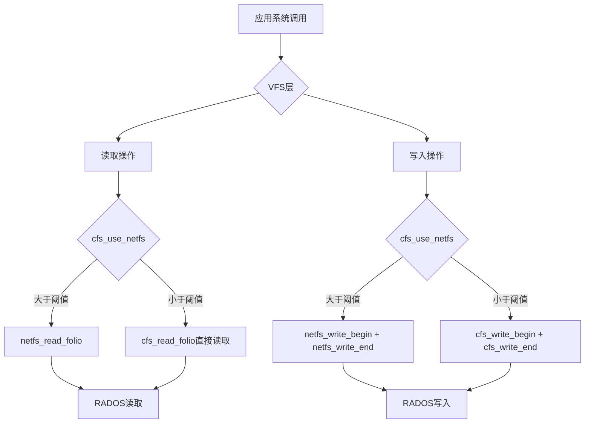
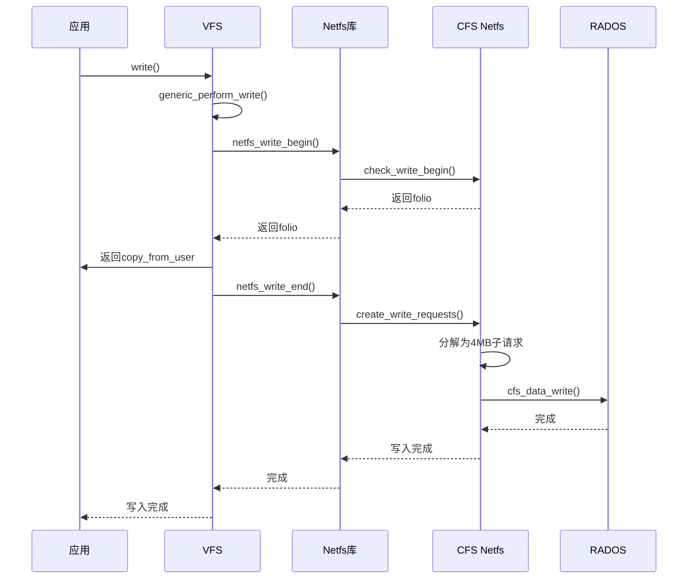

# CFS Netfs和Aops完善设计文档

## 1. 概述

本文档描述了CFS (Ceph File System Simple) 文件系统中netfs和address_space操作的完善方案。参考Ceph内核客户端的`ceph_netfs_ops`和`ceph_aops`实现，为CFS添加完整的I/O操作支持。

### 1.1 当前状态

- **cfs_netfs_ops**: 部分实现，缺少写操作相关回调
- **cfs_aops**: 部分实现，缺少页面回写和invalidate相关操作

### 1.2 目标

完善CFS以支持完整的文件系统I/O操作，包括：
- 大文件的高效netfs框架读写
- 页面缓存管理
- 脏页回写
- 直接I/O支持

---

## 2. 架构设计

### 2.1 I/O流程图



### 2.2 文件结构

| 文件 | 描述 |
|------|------|
| `fs/cfs/netfs.c` | netfs操作实现 |
| `fs/cfs/addr.c` | 地址空间操作实现 |
| `fs/cfs/super.h` | 头文件声明 |
| `fs/cfs/internal.h` | 内部定义 |

---

## 3. cfs_netfs_ops完善设计

### 3.1 当前实现分析

当前`cfs_netfs_ops`已实现：
- `init_request` - 初始化请求
- `free_request` - 释放请求
- `expand_readahead` - 扩展预读
- `clamp_length` - 长度限制
- `issue_read` - 发起读取
- `issue_write` - 发起写入
- `is_still_valid` - 有效性检查
- `check_write_begin` - 写开始检查
- `update_i_size` - 更新文件大小
- `done` - 完成处理

### 3.2 需要添加的回调

#### 3.2.1 free_subrequest

```c
void cfs_netfs_free_subrequest(struct netfs_io_subrequest *subreq)
{
    /* 释放子请求相关的私有数据 */
    /* 如果子请求有附加的页面数组，需要释放 */
}
```

**功能**: 释放netfs子请求的私有资源

**实现要点**:
- 释放在`issue_read`/`issue_write`中分配的资源
- 处理页面数组的释放

#### 3.2.2 create_write_requests

```c
void cfs_netfs_create_write_requests(struct netfs_io_request *wreq,
                                      loff_t start, size_t len)
{
    /*
     * 为写入操作创建子请求
     * 将大块写入分解为4MB的RADOS块
     */
}
```

**功能**: 将大的写请求分解为适合RADOS的子请求

**实现要点**:
- 按照4MB块边界分解
- 每个子请求对应一个RADOS对象
- 调用`netfs_create_write_request`创建子请求

#### 3.2.3 invalidate_cache

```c
void cfs_netfs_invalidate_cache(struct netfs_io_request *wreq)
{
    /*
     * 写入完成后使缓存失效
     * 对于CFS来说，数据直接在RADOS中，不需要额外处理
     */
}
```

**功能**: 使本地缓存失效

**实现要点**:
- CFS不使用本地缓存，数据直接写入RADOS
- 可以留空或做日志记录

### 3.3 完整的netfs_request_ops结构

```c
const struct netfs_request_ops cfs_netfs_ops = {
    .io_request_size     = sizeof(struct netfs_io_request),
    .io_subrequest_size  = sizeof(struct netfs_io_subrequest),
    .init_request       = cfs_netfs_init_request,
    .free_request       = cfs_netfs_free_request,
    .free_subrequest    = cfs_netfs_free_subrequest,
    .expand_readahead   = cfs_netfs_expand_readahead,
    .clamp_length       = cfs_netfs_clamp_length,
    .issue_read         = cfs_netfs_issue_read,
    .issue_write        = cfs_netfs_issue_write,
    .is_still_valid     = cfs_netfs_is_still_valid,
    .check_write_begin  = cfs_netfs_check_write_begin,
    .update_i_size      = cfs_netfs_update_i_size,
    .done               = cfs_netfs_done,
    .create_write_requests = cfs_netfs_create_write_requests,
    .invalidate_cache   = cfs_netfs_invalidate_cache,
};
```

---

## 4. cfs_aops完善设计

### 4.1 Ceph参考实现

Ceph的`ceph_aops`结构:
```c
const struct address_space_operations ceph_aops = {
    .read_folio          = netfs_read_folio,
    .readahead          = netfs_readahead,
    .writepage          = ceph_writepage,
    .writepages         = ceph_writepages_start,
    .write_begin        = ceph_write_begin,
    .write_end          = ceph_write_end,
    .dirty_folio        = ceph_dirty_folio,
    .invalidate_folio   = ceph_invalidate_folio,
    .release_folio      = netfs_release_folio,
    .direct_IO          = noop_direct_IO,
};
```

### 4.2 CFS当前实现

当前`cfs_aops`:
```c
const struct address_space_operations cfs_aops = {
    .read_folio         = cfs_read_folio,
    .readahead          = cfs_readahead,
    .write_begin        = cfs_write_begin,
    .write_end          = cfs_write_end,
    .dirty_folio        = filemap_dirty_folio,
    .migrate_folio      = filemap_migrate_folio,
    .invalidate_folio   = filemap_invalidate_folio,
    .release_folio      = filemap_release_folio,
    .is_partially_uptodate = filemap_is_partially_uptodate,
};
```

### 4.3 需要添加/修改的操作

#### 4.3.1 writepage

```c
static int cfs_writepage(struct page *page, struct writeback_control *wbc)
{
    struct inode *inode = page->mapping->host;
    struct cfs_inode_info *ci = CFS_I(inode);
    int ret;

    /* 检查是否为netfs模式 */
    if (cfs_use_netfs(inode)) {
        /* netfs框架处理 */
        return netfs_writepage(page, wbc);
    }

    /* 直接RADOS处理 - 当前实现逻辑 */
    ret = cfs_writepage_nounlock(page, wbc);
    if (ret == -ERESTARTSYS)
        ret = 0;
    unlock_page(page);
    return ret;
}

static int cfs_writepage_nounlock(struct page *page,
                                   struct writeback_control *wbc)
{
    struct inode *inode = page->mapping->host;
    struct cfs_inode_info *ci = CFS_I(inode);
    struct cfs_fs_info *fsi = CFS_SB(inode->i_sb);
    loff_t page_start = page_offset(page);
    size_t len = PAGE_SIZE;
    u32 part_num;
    struct ceph_object_id oid;
    int ret;

    /* 验证页面正确性 */
    if (!PageUptodate(page))
        return -EIO;

    /* 计算对象ID */
    part_num = cfs_part_num(page_start);
    cfs_data_oid(&oid, ci->i_ino, part_num);

    /* 写入RADOS */
    ret = cfs_data_write(fsi, &oid, cfs_part_offset(page_start),
                         len, &page, 1);

    if (ret < 0) {
        mapping_set_error(page->mapping, ret);
        return ret;
    }

    return 0;
}
```

**功能**: 将单个页面写入RADOS

#### 4.3.2 writepages

```c
static int cfs_writepages_start(struct address_space *mapping,
                                struct writeback_control *wbc)
{
    struct inode *inode = mapping->host;

    /* 使用netfs框架处理 */
    if (cfs_use_netfs(inode))
        return netfs_writepages(mapping, wbc);

    /* 直接处理模式 */
    return cfs_writepages_direct(mapping, wbc);
}

static int cfs_writepages_direct(struct address_space *mapping,
                                 struct writeback_control *wbc)
{
    struct writeback_control wbc_single = {
        .sync_mode = wbc->sync_mode,
        .nr_to_write = 1,
        .range_start = wbc->range_start,
        .range_end = wbc->range_end,
    };
    struct page *page;
    int ret = 0;

    /* 获取需要回写的页面 */
    while ((page = writeback_single_mapping(mapping, &wbc_single))) {
        ret = cfs_writepage(page, &wbc_single);
        if (ret) {
            wbc->pages_skipped++;
            break;
        }
    }

    return ret;
}
```

**功能**: 批量将脏页写入RADOS

#### 4.3.3 invalidate_folio

```c
static void cfs_invalidate_folio(struct folio *folio, size_t offset,
                                  size_t length)
{
    struct inode *inode = folio->file_mapping->host;

    /* 如果完全invalidate，清除所有私有数据 */
    if (offset == 0 && length == 0) {
        /* 清除所有私有数据 */
        folio_detach_private(folio);
    }

    /* 使用默认实现 */
    netfs_invalidate_folio(folio, offset, length);
}
```

**功能**: 使页面缓存失效

#### 4.3.4 dirty_folio

```c
static bool cfs_dirty_folio(struct address_space *mapping, struct folio *folio)
{
    struct inode *inode = mapping->host;
    struct cfs_inode_info *ci = CFS_I(inode);
    bool ret;

    /* 检查 folio 是否已经脏 */
    if (folio_test_dirty(folio))
        return false;

    /* 简单的脏页标记 - 不使用快照上下文 */
    ret = filemap_dirty_folio(mapping, folio);

    return ret;
}
```

**功能**: 标记页面为脏

**注意**: CFS不处理快照上下文，与Ceph不同，使用简化实现

#### 4.3.5 direct_IO

```c
static ssize_t cfs_direct_IO(struct kiocb *iocb, struct iov_iter *iter)
{
    struct inode *inode = iocb->ki_filp->f_mapping->host;
    loff_t offset = iocb->ki_pos;
    size_t count = iov_iter_count(iter);

    /*
     * 对于CFS，直接I/O不支持
     * 数据必须通过RADOS，可以使用netfs_unbuffered_read_iter
     */
    if (iov_iter_rw(iter) == READ)
        return netfs_unbuffered_read_iter(iocb, iter);

    /* 写操作返回不支持 */
    return -EOPNOTSUPP;
}
```

**功能**: 支持直接I/O（读取）

#### 4.3.6 launder_folio

```c
static int cfs_launder_folio(struct folio *folio)
{
    struct inode *inode = folio->file_mapping->host;
    struct writeback_control wbc = {
        .sync_mode = WB_SYNC_ALL,
        .nr_to_write = 1,
    };
    int ret = 0;

    if (folio_clear_dirty_for_io(folio)) {
        ret = cfs_writepage(&folio->page, &wbc);
    }

    return ret;
}
```

**功能**: 将脏页清洗回磁盘

### 4.4 完整的address_space_operations结构

```c
const struct address_space_operations cfs_aops = {
    .read_folio         = cfs_read_folio,
    .readahead          = cfs_readahead,
    .writepage          = cfs_writepage,
    .writepages         = cfs_writepages_start,
    .write_begin        = cfs_write_begin,
    .write_end          = cfs_write_end,
    .dirty_folio        = cfs_dirty_folio,
    .invalidate_folio   = cfs_invalidate_folio,
    .release_folio      = netfs_release_folio,
    .launder_folio      = cfs_launder_folio,
    .direct_IO          = cfs_direct_IO,
};
```

---

## 5. 页面大小阈值设计

### 5.1 Netfs启用阈值

CFS使用文件大小阈值来决定是否使用netfs框架：

```c
static inline bool cfs_use_netfs(struct inode *inode)
{
    struct cfs_fs_info *fsi = CFS_SB(inode->i_sb);
    u64 threshold;

    /* 检查netfs是否启用 */
    if (!fsi->netfs_ops)
        return false;

    /* 获取阈值 */
    threshold = fsi->opts->netfs_threshold;
    if (threshold == 0)
        threshold = CFS_NETFS_DEFAULT_THRESHOLD;  /* 64MB */

    return i_size_read(inode) >= threshold;
}
```

### 5.2 阈值配置

- **默认值**: 64MB
- **可配置**: 通过mount选项设置
- **目的**: 对大文件使用netfs框架优化I/O，对小文件使用直接RADOS操作

---

## 6. 写操作流程

### 6.1 Netfs模式写流程



### 6.2 直接模式写流程

```
write() -> cfs_write_begin() -> cfs_write_end() -> cfs_data_write() -> RADOS
```

---

## 7. 错误处理

### 7.1 读取错误

- 网络超时: 重试机制
- 对象不存在: 返回零数据（文件孔）
- 权限错误: 返回-EACCES

### 7.2 写入错误

- 映射错误: 设置mapping错误标志
- 回写失败: 保留在页面缓存中
- 磁盘满: 返回-ENOSPC

---

## 8. 实现顺序

1. 完善`cfs_netfs_ops`中的`free_subrequest`
2. 添加`create_write_requests`和`invalidate_cache`
3. 添加`writepage`函数
4. 添加`writepages`函数
5. 添加`invalidate_folio`函数
6. 添加`dirty_folio`函数
7. 添加`direct_IO`函数
8. 添加`launder_folio`函数
9. 更新`cfs_aops`结构
10. 测试验证

---

## 9. 兼容性考虑

### 9.1 Linux版本兼容性

- 使用Linux 6.6+的netfs库API
- 适配新旧API差异

### 9.2 Ceph兼容性

- 使用libceph的OSD客户端接口
- 兼容Ceph nautilus及以上版本

---

## 10. 总结

本文档详细描述了完善CFS的netfs和address_space操作的设计方案。通过参考Ceph内核客户端的实现，并结合CFS自身的特点（直接使用RADOS存储，无本地缓存），制定了完整的实现计划。

关键设计决策：

1. **混合I/O模式**: 小文件直接RADOS，大文件使用netfs框架
2. **4MB块对齐**: 所有I/O操作与RADOS对象边界对齐
3. **简化快照处理**: CFS不需要像Ceph那样的复杂快照上下文
4. **Netfs框架优势**: 利用netfs库的预读、聚合等优化
