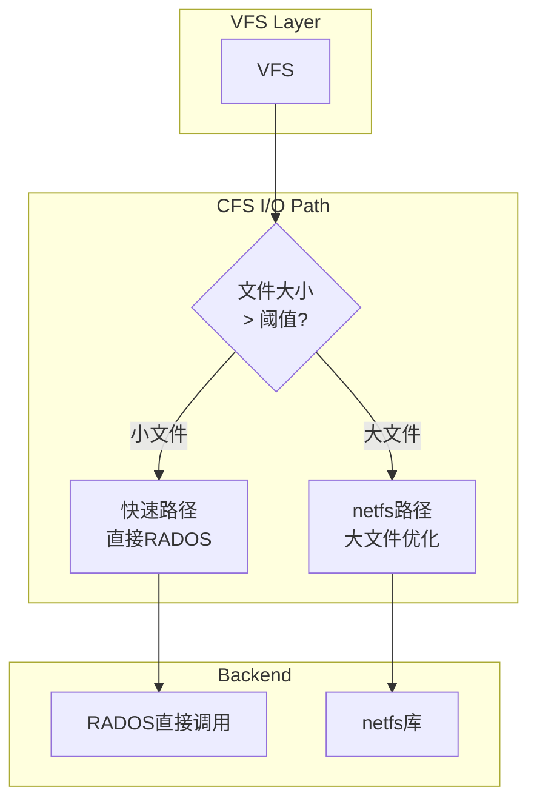

# CFS部分集成netfs框架实施计划

## 1. 概述

本计划描述如何部分集成Linux网络文件系统辅助库(netfs)到CFS(Ceph FileSystem Simple)中。方案采用混合I/O模式，保留现有的直接RADOS调用，同时为大文件场景提供netfs框架支持。

## 2. 当前CFS实现状态分析

### 2.1 现有架构

```
┌─────────────────────────────────────────────────────┐
│                   VFS Layer                          │
├─────────────────────────────────────────────────────┤
│  file.c: cfs_file_read_iter / cfs_file_write_iter  │
│  addr.c: cfs_read_folio / cfs_write_begin          
├─────────────────────────────────────────────────────┤
│              CFS Layer (直接RADOS调用)              │
│  使用cfs_data_read() / cfs_data_write()            │
├─────────────────────────────────────────────────────┤
│              RADOS Layer (OSD Client)               │
└─────────────────────────────────────────────────────┘
```

### 2.2 现有实现的特点

- **直接RADOS调用**: 所有读写操作直接调用RADOS API
- **简单高效**: 无额外抽象层，开销小
- **无缓存支持**: 不支持本地磁盘缓存
- **不支持大文件优化**: 无分段读取、失败重试等高级特性

## 3. netfs框架分析

### 3.1 netfs框架能力

netfs框架提供以下能力：

1. **I/O请求管理**: 自动将大请求拆分为小请求
2. **失败重试机制**: 自动重试失败的I/O操作
3. **缓存支持**: 可选的本地磁盘缓存
4. **读写优化**: 
   - 预读(readahead)优化
   - 写合并(write coalescing)
   - 零填充(zero-filling)

### 3.2 Ceph FS集成方式

Ceph FS使用netfs框架的方式：

- 嵌入`struct netfs_inode`到`struct ceph_inode_info`中
- 实现`netfs_request_ops`回调
- 注册到address_space_operations

## 4. 部分集成方案设计

### 4.1 设计目标

1. **保持简单性**: 保留现有的直接RADOS调用作为默认路径
2. **渐进增强**: 为大文件场景提供netfs框架支持
3. **可配置**: 用户可选择启用/禁用netfs功能
4. **向后兼容**: 不影响现有功能

### 4.2 混合I/O模式架构



### 4.3 关键设计决策

#### 4.3.1 文件大小阈值

- **阈值**: 64MB (可通过mount选项配置)
- **原因**: 
  - 小文件: 直接RADOS调用开销更小
  - 大文件: netfs框架的拆分、重试优势明显

#### 4.3.2 I/O路径选择

| 条件 | 路径 |
|------|------|
| 文件大小 < 64MB | 直接RADOS调用 |
| 文件大小 >= 64MB | netfs框架 |
| mount指定force_netfs | 全部使用netfs |
| mount指定no_netfs | 全部使用直接RADOS |

### 4.4 需要的修改

## 5. 详细实施步骤

### 5.1 第一步：数据结构修改

#### 5.1.1 修改super.h - 添加netfs支持字段

```c
// 在cfs_fs_info中添加:
struct cfs_fs_info {
    // ... 现有字段 ...
    
    /* netfs支持 */
    bool use_netfs;               // 是否启用netfs
    u64 netfs_threshold;         // 使用netfs的文件大小阈值
    const struct netfs_request_ops *netfs_ops;  // netfs操作
};

// 在cfs_inode_info中添加:
struct cfs_inode_info {
    // ... 现有字段 ...
    
    /* netfs支持 */
    struct netfs_inode netfs;    // netfs上下文
    bool use_netfs_path;         // 当前inode使用netfs路径
};
```

#### 5.1.2 添加mount选项

```c
enum cfs_param {
    // ... 现有 ...
    Opt_netfs_threshold,    // 新增: netfs阈值
    Opt_force_netfs,       // 新增: 强制使用netfs
    Opt_no_netfs,          // 新增: 禁用netfs
};
```

### 5.2 第二步：实现netfs回调函数

#### 5.2.1 创建netfs回调实现 (cfs_netfs.c)

```c
/*
 * 实现以下回调函数:
 * - init_request: 初始化I/O请求
 * - free_request: 释放I/O请求  
 * - issue_read: 发起读取请求到RADOS
 * - expand_readahead: 扩展预读范围
 * - clamp_length: 限制请求长度
 * - done: I/O完成处理
 */

// 示例: issue_read实现
static void cfs_netfs_issue_read(struct netfs_io_subrequest *subreq)
{
    struct netfs_io_request *rreq = subreq->rreq;
    struct inode *inode = rreq->inode;
    struct cfs_inode_info *ci = CFS_I(inode);
    struct cfs_fs_info *fsi = CFS_SB(inode->i_sb);
    struct ceph_object_id oid;
    u64 offset = subreq->start;
    u64 len = subreq->len;
    int ret;
    
    /* 计算RADOS对象和偏移 */
    cfs_data_oid(&oid, ci->i_ino, cfs_part_num(offset));
    
    /* 获取pages */
    // ... 使用io_iter获取pages ...
    
    /* 调用RADOS读取 */
    ret = cfs_data_read(fsi, &oid, cfs_part_offset(offset),
                        len, pages, num_pages);
    
    if (ret < 0)
        netfs_subreq_terminated(subreq, ret, false);
    else
        netfs_subreq_terminated(subreq, ret, false);
}
```

### 5.3 第三步：修改地址空间操作

#### 5.3.1 修改addr.c - 添加netfs路径桥接

```c
/*
 * 新的读写入口函数，根据文件大小选择路径
 */

// 读取入口
int cfs_read_folio(struct file *file, struct folio *folio)
{
    struct inode *inode = folio->file_mapping->host;
    struct cfs_inode_info *ci = CFS_I(inode);
    struct cfs_fs_info *fsi = CFS_SB(inode->i_sb);
    
    /* 选择I/O路径 */
    if (cfs_should_use_netfs(fsi, inode))
        return netfs_read_folio(file, folio);  // netfs路径
    
    return cfs_read_folio_direct(file, folio); // 直接RADOS路径
}

// 预读入口
static void cfs_readahead(struct readahead_control *rac)
{
    struct inode *inode = rac->file_mapping->host;
    struct cfs_fs_info *fsi = CFS_SB(inode->i_sb);
    
    if (cfs_should_use_netfs(fsi, inode))
        netfs_readahead(rac);  // netfs路径
    else
        cfs_readahead_direct(rac);  // 直接RADOS路径
}

// 写开始入口
int cfs_write_begin(struct file *file, struct address_space *mapping,
                    loff_t pos, unsigned len, struct folio **foliop,
                    void **fsdata)
{
    struct inode *inode = mapping->host;
    struct cfs_fs_info *fsi = CFS_SB(inode->i_sb);
    struct netfs_inode *ctx = &CFS_I(inode)->netfs;
    
    if (cfs_should_use_netfs(fsi, inode))
        return netfs_write_begin(ctx, file, mapping, pos, len,
                                 foliop, fsdata);
    
    return cfs_write_begin_direct(file, mapping, pos, len,
                                  foliop, fsdata);
}
```

### 5.4 第四步：修改文件操作

#### 5.4.1 修改file.c - 添加读写迭代器

```c
// 读取迭代器
ssize_t cfs_file_read_iter(struct kiocb *iocb, struct iov_iter *iter)
{
    struct inode *inode = file_inode(iocb->ki_filp);
    struct cfs_fs_info *fsi = CFS_SB(inode->i_sb);
    
    /* 根据文件大小和配置选择路径 */
    if (cfs_should_use_netfs(fsi, inode))
        return netfs_file_read_iter(iocb, iter);
    
    return cfs_read_iter_direct(iocb, iter);
}

// 写入迭代器
ssize_t cfs_file_write_iter(struct kiocb *iocb, struct iov_iter *iter)
{
    struct inode *inode = file_inode(iocb->ki_filp);
    struct cfs_fs_info *fsi = CFS_SB(inode->i_sb);
    
    if (cfs_should_use_netfs(fsi, inode))
        return netfs_file_write_iter(iocb, iter);
    
    return cfs_write_iter_direct(iocb, iter);
}
```

### 5.5 第五步：inode初始化修改

#### 5.5.1 修改inode.c - 初始化netfs上下文

```c
void cfs_init_inode(struct inode *inode, struct cfs_dentry_metadata *dmeta)
{
    struct cfs_inode_info *ci = CFS_I(inode);
    struct cfs_fs_info *fsi = CFS_SB(inode->i_sb);
    
    /* 初始化基本字段... */
    
    /* 初始化netfs上下文 */
    if (fsi->use_netfs) {
        netfs_inode_init(&ci->netfs, fsi->netfs_ops, false);
        
        /* 设置netfs相关标志 */
        ci->use_netfs_path = cfs_should_use_netfs(fsi, inode);
    } else {
        ci->use_netfs_path = false;
    }
}
```

### 5.6 第六步：创建辅助函数

#### 5.6.1 创建cfs_netfs_utils.c

```c
/*
 * I/O路径选择判断函数
 */
bool cfs_should_use_netfs(struct cfs_fs_info *fsi, struct inode *inode)
{
    u64 file_size;
    
    /* 强制选项检查 */
    if (fsi->opts->force_netfs)
        return true;
    if (fsi->opts->no_netfs)
        return false;
    
    /* netfs未启用 */
    if (!fsi->use_netfs)
        return false;
    
    /* 文件大小阈值检查 */
    file_size = i_size_read(inode);
    return file_size >= fsi->netfs_threshold;
}
```

## 6. 文件修改清单

| 文件 | 修改内容 | 优先级 |
|------|----------|--------|
| `fs/cfs/super.h` | 添加netfs相关结构体和字段 | 高 |
| `fs/cfs/super.c` | 添加mount选项解析 | 高 |
| `fs/cfs/internal.h` | 添加辅助函数声明 | 中 |
| `fs/cfs/inode.c` | 初始化netfs上下文 | 高 |
| `fs/cfs/addr.c` | 添加路径选择逻辑 | 高 |
| `fs/cfs/file.c` | 添加路径选择逻辑 | 高 |
| `fs/cfs/Makefile` | 添加新源文件 | 中 |
| `fs/cfs/Kconfig` | 添加配置选项 | 低 |

## 7. 新增文件

| 文件 | 描述 |
|------|------|
| `fs/cfs/netfs.c` | netfs回调实现 |
| `fs/cfs/netfs.h` | netfs相关声明 |

## 8. 配置选项

```
CONFIG_CFS=y
CONFIG_CFS_NETFS=[y/n]    # 启用netfs支持，默认y
CONFIG_CFS_NETFS_THRESHOLD=64  # 默认阈值64MB
```

## 9. Mount选项

```
mount -t cfs -o mon_addr=xxx,meta_pool=xxx,data_pool=xxx,netfs_threshold=64M /dev/sda1 /mnt
```

选项说明:
- `netfs_threshold=N` - 使用netfs的文件大小阈值(默认64M)
- `force_netfs` - 强制所有文件使用netfs路径
- `no_netfs` - 禁用netfs，使用直接RADOS调用

## 10. 测试计划

### 10.1 单元测试
- 小文件读写(< 64MB)
- 大文件读写(>= 64MB)
- 阈值边界测试

### 10.2 性能测试
- 小文件吞吐量
- 大文件吞吐量
- 混合工作负载

### 10.3 回归测试
- 现有功能不受影响
- 错误处理正确

## 11. 风险与缓解

| 风险 | 影响 | 缓解措施 |
|------|------|----------|
| 代码复杂度增加 | 维护困难 | 保持清晰的代码结构 |
| 路径选择错误 | 数据错误 | 充分测试边界条件 |
| 性能回退 | 性能下降 | 保留直接RADOS路径作为默认 |

## 12. 总结

本方案通过部分集成netfs框架，在保持CFS简单性的同时，为大文件场景提供更好的I/O支持。主要特点：

1. **渐进式集成**: 不影响现有小文件场景
2. **可配置**: 用户可根据需求调整
3. **保持简单**: 避免过度工程化
4. **向后兼容**: 现有功能不受影响